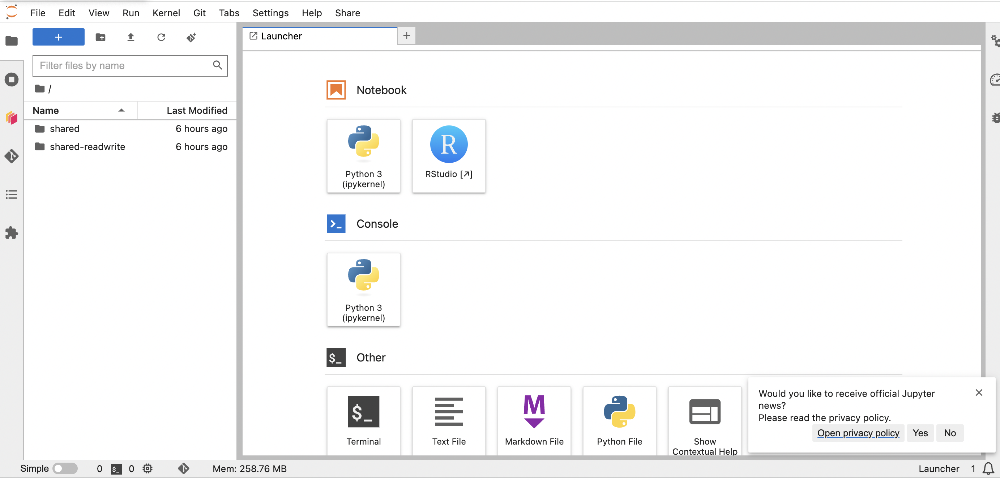
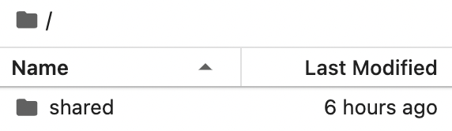

{width=200px}


## Log into the JupyterHub

Go to <https://workshop.nmfs-openscapes.2i2c.cloud/>. Login with an email address and the password that we supply.


### Image type:

We will use the default Py-R - base geospatial image.

### Virtual Machine size

You'll see something similar to this that allows you to choose a large virtual machine if your project needs it. For the tutorials, you will only need the Small Virtual Machine (default). Please only choose the large machines if you run out of RAM as the larger machines cost us more.


### Start up

After we select our server type and click on start, JupyterHub will allocate our instance in the cloud (on Azure). This may take several minutes. 


## The Launcher

When you are in the Jupyter Lab tab (note the Jupyter Logo), you will see a Launcher page. If you don't see this, go to File > New Launcher or click the blue button on left.



## Open a terminal

Click the "Terminal" button at the bottom. Copy in the following code:

```
cd ~
git clone https://github.com/nmfs-opensci/EDMW-2H-tutorials-2025
```

## End your session

When you are finished working for the day it is important to log out of the Jupyter Hub.  When you keep a session active it uses up cloud resources (costs money) and keeps a series of virtual machines deployed.


**From the Jupyter Lab tab**

* File -> Hub Control Panel -> Stop My Server


## Restart your server

Sometimes the server will crash/stop. This can happen if too many people use a lot of memory all at once. If that happens, go to the Jupyter Lab tab and then File -> Hub Control Panel -> Stop My Server and then Start My Server. You shouldn't lose your work unless you were uploading a file.

## Your files

When you start your server, you will have access to your own virtual drive space. No other users will be able to see or access your files. You can upload files to your virtual drive space and save files here. You can create folders to organize your files. You personal directory is `home/jovyan`. Everyone has the same home directory but your files are separate and cannot be seen by others.

There are a number of different ways to create new files. We will practice this in the RStudio lecture.

### Will I lose all of my work?

Logging out will **NOT** cause any of your work to be lost or deleted. It simply shuts down some resources. It would be equivalent to turning off your desktop computer at the end of the day.

## Shared files




In the file panel, you will see a folder called `shared`. These are read-only shared files. 

You will also see `shared-public`. This is a read-write folder for you to put files for everyone to see and use. You can create a team folder here for shared data and files.  Note, everyone can see and change these so be careful to communicate with your team so multiple people don't work on the same file at the same time. You can also create folders for each team member and agree not to change other team members files.

## **Python users

You can open a Jupyter Notebook by clicking on the "Python 3" box. In the Launcher tab:


Jupyter notebooks are a very common way to share Python code and tutorials. Get an overview of Jupyter Lab: [Intro to Jupyter Lab](./content/jupyter-notebooks.html) Learn about the [geosciences tools in Python](https://foundations.projectpythia.org)


## FAQ

**Why do we have the same home directory as /home/jovyan?** /home/jovyan is the default home directory for 'jupyter' based images/dockers. It is the historic home directory for Jupyter deployments. 

**Can other users see the files in my /home/jovyan folder?** No, other users can not see your credentials.


### Acknowledgements

Some sections of this document have been taken from  hackweeks organized by the University of Washington eScience Institute and Openscapes.

