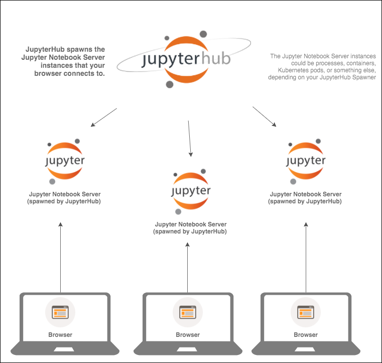
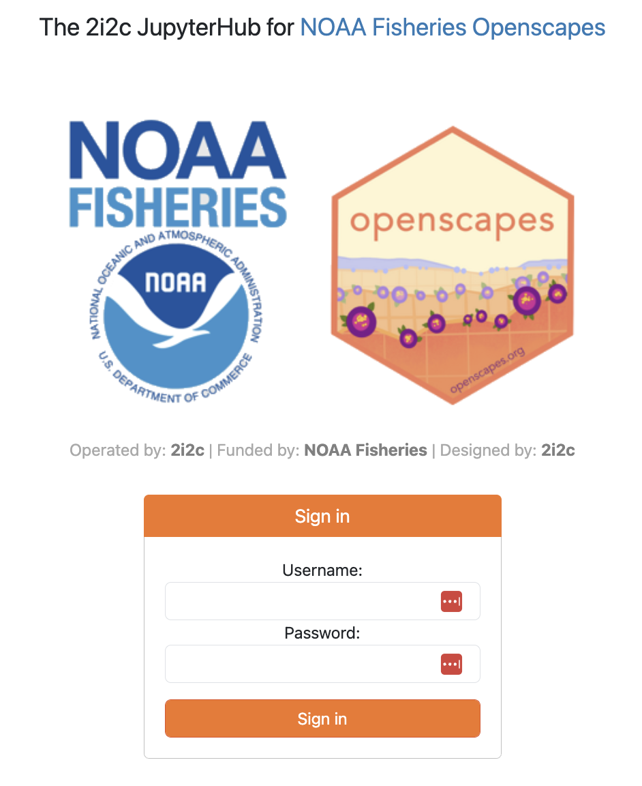
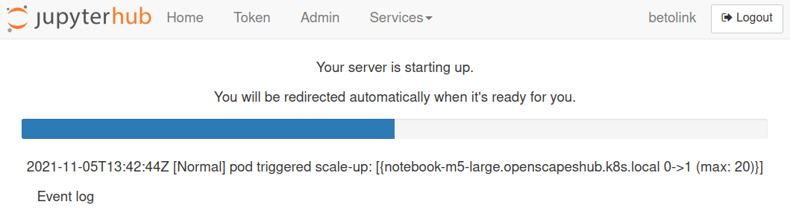
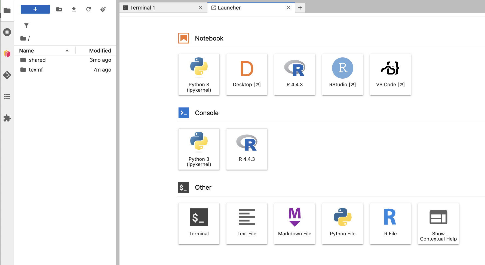
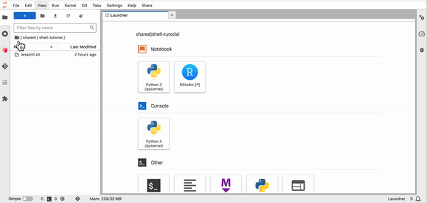
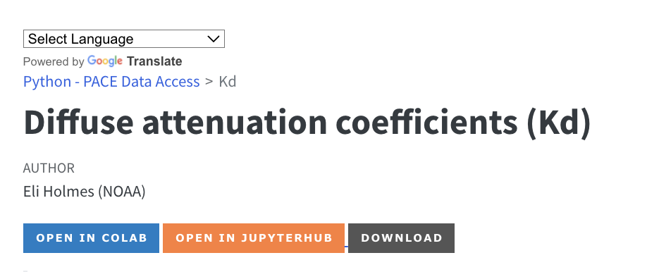

## What is a Jupyter Hub?

{width=400px}

## Log into the Jupyter Hub

Go to <https://workshop.nmfs-openscapes.2i2c.cloud/>. Login with an email address and the password that we supply.

{width=400px}

## Selecting your server


### Image type:

We will use the default Py-R - base geospatial image.

### Resource Allocation

We will use the default 1.9 Gb RAM or 3.8 Gb RAM (MOANA tutorial).

### Start up

After we select our server type and click on start, JupyterHub will allocate our instance in the cloud (on Azure). This may take several minutes. 




## The Launcher

When you are in the Jupyter Lab tab (note the Jupyter Logo), you will see a Launcher page. If you don't see this, go to File > New Launcher or click the blue button on left.



## Get the tutorials

### In the Jupyter Hub

1. Clone the repo. Click the "Terminal" button at the bottom. Copy in the following code:

```
cd ~
git clone https://github.com/nmfs-opensci/EDMW-4A-tutorials-2025
```

2. Open

Go to the folder icon and look for `EDMW-4A-tutorials-2025`. Click on that and you will see
the tutorials listed. Double click on a tutorial name to open.



### Not in the Jupyter Hub?



## Jupyter Lab basics

* Running a code cell
* Running all code cells
* Add a new code cell
* Deleting a code cell
* Restarting your kernel
* Changing the kernel (we will not need to do this)
* Changing the code type (we will not need to do this)

## End your session

When you are finished working for the day it is important to log out of the Jupyter Hub.  When you keep a session active it uses up cloud resources (costs money) and keeps a series of virtual machines deployed.

File -> Hub Control Panel -> Stop My Server

## Your files

When you start your server, you will have access to your own virtual drive space. No other users will be able to see or access your files. You can upload files to your virtual drive space and save files here. You can create folders to organize your files. You personal directory is `home/jovyan`. Everyone has the same home directory but your files are separate and cannot be seen by others.

There are a number of different ways to create new files. We will practice this in the RStudio lecture.

### Will I lose all of my work?

Logging out will **NOT** cause any of your work to be lost or deleted. It simply shuts down some resources. It would be equivalent to turning off your desktop computer at the end of the day.


## FAQ

**Why do we have the same home directory as /home/jovyan?** /home/jovyan is the default home directory for 'jupyter' based images/dockers. It is the historic home directory for Jupyter deployments. 

**Can other users see the files in my /home/jovyan folder?** No, other users can not see your credentials.

