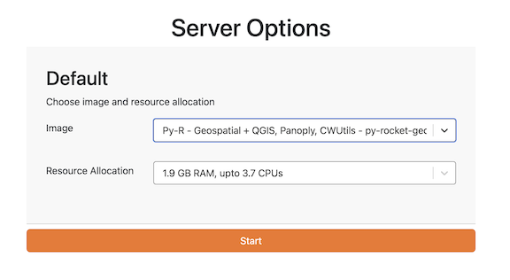

## Earth Data Login

To get data from NASA Earthdata, you will need to register and get a username and password. Register here: <https://urs.earthdata.nasa.gov/>. Write down your username and password; you will need it often.

## JupyterHub

1. Go to our JupyterHub: <https://workshop.nmfs-openscapes.2i2c.cloud/> 
2. Log in with your email and the workshop password. If you are NOAA, [click here](https://docs.google.com/document/d/1YS3Vg0w4kR4PPttToNtTccJN1IfVArT5sOCg-K4_kb4/edit?usp=sharing) to see the password. If you are not-NOAA, we will give the password during the workshop. 
3. Once you are in, Click Start Server.


## Getting the tutorials into the JupyterHub

Once you are logged into the JupyterHub, go to a tutorial in <https://nmfs-opensci.github.io/EDMW-EarthData-Workshop-2025/> and click on .
This will open the tutorial in the workshop JupyterHub.


Alternatively, you can clone the repo and go into the tutorials/clean directory. Open a terminal with File > New > Terminal. Then type this on the command line:

```
cd ~
git clone https://github.com/nmfs-opensci/EDMW-EarthData-Workshop-2025
```


## Colab

You can run the tutorials in Colab but you will need to install the packages. Create a new code
cell at the top of the notebook (after clicking the "Open in Colab") button. Run the following pip install commands
and then do Runtime > Restart session. Yes it will delete local variables. That's ok. If you don't 
restart the session, xarray cannot fine the engines it needs.

* For tutorial 1: `pip install earthaccess xarray[io]`
* For tutorial 2 (Rrs): `pip install earthaccess cartopy xarray[io]`
* For tutorial 3 (Kd): `pip install earthaccess cartopy xarray[io] hvplot`
* For tutorial 4 (MOANA): `pip install cartopy xarray[io]`


