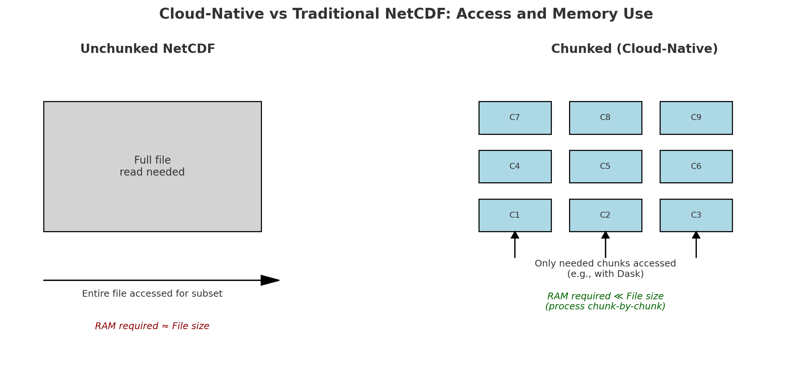
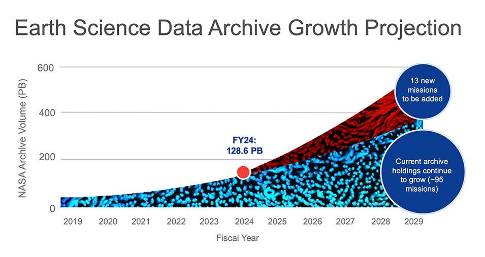

### FTP

```{mermaid}
flowchart LR

%% Server-Based Access
    S_C1[Client A] <-- whole file --> S_SRV[Central Server<br/>I/O limited by its capacity<br />No extra services]
    S_SRV --> S_DISK[NetCDF Files]
```

### ERDDAP / OPeNDAP

```{mermaid}
flowchart LR

    S_C1[Client A] <-- subset of file --> S_SRV[Central Server<br/>I/O limited by its capacity<br />extra services]
    S_C2[Client] <-- subset of file --> S_SRV
    S_C3[Client] <-- subset of file --> S_SRV
    S_SRV --> S_DISK[NetCDF Files]
```


### Cloud object storage

```{mermaid}
flowchart LR

    S_D1[Client] <-- chunk of data --> S_SRV[Cloud Object Storage<br/>No client limits<br />Chunked NetCDF Files<br />No extra services]
    S_D2[Client] <-- chunk of data --> S_SRV
    S_D3[Client] <-- chunk of data --> S_SRV
    S_D4[Client] <-- chunk of data --> S_SRV
    S_D5[Client] <-- chunk of data --> S_SRV
    S_D6[Client] <-- chunk of data --> S_SRV
    S_SRV <-- chunk of data --> S_C1[Client]
    S_SRV <-- chunk of data --> S_C2[Client]
    S_SRV <-- chunk of data --> S_C3[Client]
    S_SRV <-- chunk of data --> S_C4[Client]
    S_SRV <-- chunk of data --> S_C5[Client]
    S_SRV <-- chunk of data --> S_C6[Client]
```

## Server versus Object Storage

Let's use a metaphor of a customers wanting to get sandwiches. A server system (ERDDAP/OPeNDAP) is like a restaurant while the cloud-native data in 
object storage buckets (S3, GCS, etc) is like a food court with pre-prepared sandwiches.

| **Model**                                  | **Metaphor**                                           | **How It Works**                                                                                                                                    |
| ------------------------------------------ | ------------------------------------------------------ | --------------------------------------------------------------------------------------------------------------------------------------------------- |
| **ERDDAP / OPeNDAP**                       |  *Restaurant with multiple waiters but one kitchen that prepares the sandwiches* | Each client request is handled by a thread (waiter), but all data is read from the same disk (kitchen). Concurrent access is limited by server I/O. |
| **Cloud-Native in Object Storage (S3/GCS)** | *Food court with many self-serve stations and pre-prepared sandwiches*          | Clients fetch just the data chunks they need directly from cloud storage. No central bottleneck — reads happen in parallel and scale with demand.   |

### Key difference

1. Cloud-native formats and object storage buckets remove the kitchen bottleneck by letting each client serve themselves from pre-prepared, independently accessible data chunks.
2. Cloud-native formats^* is 'pre-packaged' into to chunks that ready for grab and go. Cloud-native can also be thought of as 'read-optimized'.

* Examples of cloud-native formats: Zarr, GeoTIFF, legacy netCDFs with a sidecar file (kerchunk, VirtualiZarr) that let's you grab chunks

## Cloud-Native is Read-Optimized

This means (among other things) chunked data.




## Why not just download the data?

How will you work with data larger than memory?

