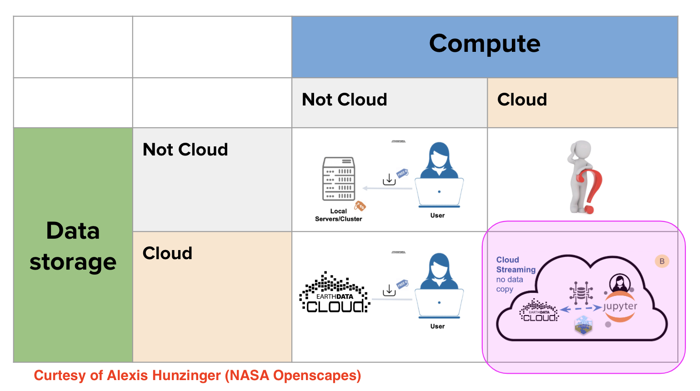

## Zoom link

EDM Workshop website: Once you are added to the sched event site, you can go to [website](https://2025noaaedmw.sched.com) and log in. Once you are logged in, navigate to Workshop 4A [Part I](https://2025noaaedmw.sched.com/event/1z0CM/4a-workshop-introduction-to-using-earth-data-in-the-cloud-for-scientific-workflows-pace-hyperspectral-ocean-color-data-part-i) and [Part II](https://2025noaaedmw.sched.com/event/1z0CM/4a-workshop-introduction-to-using-earth-data-in-the-cloud-for-scientific-workflows-pace-hyperspectral-ocean-color-data-part-ii) and add them to your schedule. 

### Prerequisites

If you want to follow along with our tutorials during the workshop on our Jupyter Hub:

[Click here](https://docs.google.com/document/d/1YS3Vg0w4kR4PPttToNtTccJN1IfVArT5sOCg-K4_kb4/edit?usp=sharing) (NOAA only) for instructions and to get the password (NOAA access only)

*What if I am non-NOAA?* We will give the password to the Jupyter Hub out during the workshop. NOAA staff are welcome to get on beforehand.

*Do I need to use the Jupyter Hub?* No. You can run the tutorials in Colab, Binder, or download and run on your own computer.

Welcome to the NOAA Fisheries workshop focused on geospatial analysis using ocean 'big data'. Today, we are focused on using PACE hyperspectral ocean color data from NASA [EarthData](https://www.earthdata.nasa.gov/).

This workshop is focused on those who are brand new to working with earth data in the cloud and with geospatial packages. You will be introduced to cloud access to PACE hyperspectral  data via Python and vizualization in Python or R. This workshop will also introduce working with [JupyterHubs](https://jupyter.org/hub). We will Jupyter Lab (Python) and RStudio (R) within our JupyterHub. 

[SCHEDULE](schedule.html) (see nav bar to left)

## Resources

### PACE tutorials

* [PACE website](https://pace.gsfc.nasa.gov/)
* [PACE Help Hub](https://oceancolor.gsfc.nasa.gov/resources/docs/tutorials/)
* [PACE HackWeek 2024 tutorials and lectures](https://pacehackweek.github.io/pace-2024/intro.html) in Python
* [PACE tutorials in the NOAA HackHours page](https://nmfs-opensci.github.io/NMFSHackDays-2025/topics-2025/2025-PACE/)
* [Hyperspectral products for fisheries](https://ocean-satellite-tools.github.io/fish-pace/)

### General tutorials

* [NASA EarthData Cloudbook](https://nasa-openscapes.github.io/earthdata-cloud-cookbook/) for many tutorials on using satellite data in Python and R and NASA Earth Data
* [Project Pythia](https://cookbooks.projectpythia.org/)
* [IOOS Python Cookbooks](https://ioos.github.io/ioos_code_lab/content/code_gallery/gallery.html)
* [IOOS CodeLab](https://ioos.github.io/ioos_code_lab/content/intro.html) collection of tutorials and examples of how to access and utilize the many IOOS technologies and data sources available.

## Thank you for inspiration and content!

Thank you to the open science community that has created software, teaching resources, and workflows that we have been able to build off of and be inspired by. These include: [PACE HackWeek team](https://pacehackweek.github.io/pace-2025/)  &bullet;
[NASA Openscapes](https://nasa-openscapes.github.io) &bullet; 
[OceanHackWeek](https://oceanhackweek.org) &bullet; 
[SnowEx Hackweek](https://snowex.hackweek.io/) &bullet; 
[eScience Institute, University of Washington](https://guidebook.hackweek.io/intro.html) &bullet; 
[ICESat-2 Hackweek](https://icesat-2-2022.hackweek.io/) &bullet;
[Project Jupyter](https://jupyter.org/) &bullet; 
[Pangeo Project](https://pangeo.io/) &bullet; 
[CryoCloud](https://cryointhecloud.com/)
  

