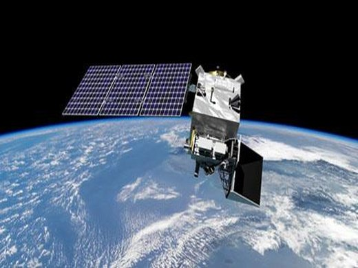
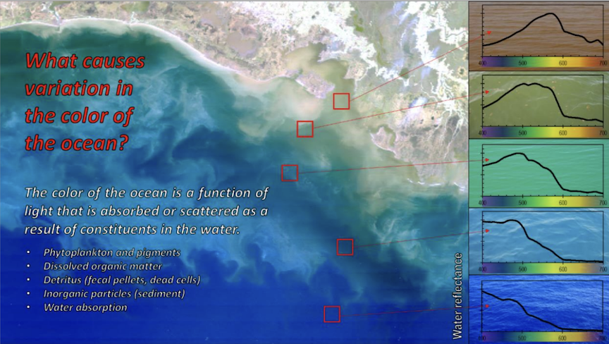

::: {style="vertical-align: middle; text-align:center; border-style: solid;   border-color: blue;   border-width: 5px;   padding: 5px; font-size: 120%;"}
Welcome to the NOAA Fisheries workshop focused on geospatial analysis using ocean ‘big data’. Today, we are focused on data from the NASA [Phytoplankton, Aerosol, Cloud and ocean Ecosystem](https://pace.oceansciences.org/) mission. This workshop is for those who are new to working with earth data in the cloud. We will be working in Python, but you will be given notebooks so you do not need to write code. This workshop will also introduce working with Jupyter Hubs, Jupyter Lab and the Pangeo Python tooling for 'big data' geospatial analysis.

Sept 2025! Fish-PACE Hackweek (virtual). Please go to the [Fish-PACE website](https://ocean-satellite-tools.github.io/hackweek-2025/) to sign up for notifications.

{width="300"}
:::

 

This workshop was given at the [2025 NOAA EDM Workshop](https://2025noaaedmw.sched.com/). The recordings are viewable by NOAA Staff: [Part I](https://drive.google.com/file/d/1evz5fl3SA8vwFIXn-OmiHu5MYlJz1h6S/view) and [Part II](https://drive.google.com/file/d/1y8_QrWzE606Oo3N2dvZcTk2IUdaO7tvh/view).

## PACE Ocean Color products

-   What is the color of the ocean? (Rrs)
-   What/who is there? (phytoplankton composition, SPM)
-   How much of it is there? (chlorophyll concentration, particulate/phytoplankton carbon etc.)
-   Are they shiny/colorful? (IOPs)
-   How much light is there? (PAR/Kd)
-   What are the phytoplankton doing? (Primary productivity)
-   How are they doing? (Fluorescence Line Height)

<figure>

</figure>

